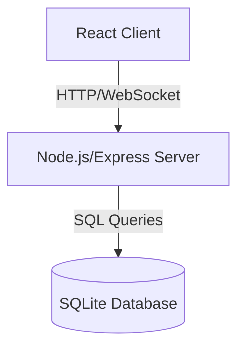

# Design Document

## Overview

The Calculation Tree Application is a full-stack web application built with a React frontend and Node.js backend. The system enables users to create and interact with mathematical calculation trees through a RESTful API. The application uses JWT-based authentication, SQLite for data persistence, and WebSocket for real-time updates.

## Architecture

### System Architecture



### Technology Stack

**Frontend:**
- React 18 with TypeScript
- React Router for navigation
- Fetch API for HTTP requests
- WebSocket client for real-time updates
- CSS for styling

**Backend:**
- Node.js with Express
- TypeScript
- SQLite3 for database
- JWT for authentication
- bcrypt for password hashing
- ws library for WebSocket server

**DevOps:**
- Docker for containerization
- Docker Compose for orchestration
- Multi-stage builds for optimization

## Components and Interfaces

### Frontend Components

#### 1. App Component
- Root component managing routing and authentication state
- Maintains global user session
- Provides authentication context to child components

#### 2. CalculationTreeList Component
- Displays all calculation trees
- Renders each tree with TreeNode components
- Handles real-time updates via WebSocket
- Available to all users (registered and unregistered)

#### 3. TreeNode Component (Recursive)
- Renders a single calculation node
- Displays: operation type, arguments, result
- Recursively renders child nodes
- Shows "Add Operation" button for registered users
- Handles node expansion/collapse

#### 4. AuthForm Component
- Dual-purpose form for login and registration
- Validates input fields
- Displays error messages
- Switches between login/register modes

#### 5. CreateStartingNumber Component
- Form for registered users to create new calculation trees
- Validates numerical input
- Submits to API and updates UI

#### 6. AddOperation Component
- Modal or inline form for adding operations
- Dropdown for operation type (+, -, *, /)
- Input field for right argument
- Validates division by zero
- Submits operation to API

### Backend API Endpoints

#### Authentication Endpoints

```
POST /api/auth/register
Body: { username: string, password: string }
Response: { message: string, userId: number }

POST /api/auth/login
Body: { username: string, password: string }
Response: { token: string, username: string, userId: number }
```

#### Calculation Tree Endpoints

```
GET /api/trees
Response: { trees: CalculationTree[] }

POST /api/trees
Headers: Authorization: Bearer <token>
Body: { startingNumber: number }
Response: { tree: CalculationTree }

POST /api/trees/:treeId/operations
Headers: Authorization: Bearer <token>
Body: { parentNodeId: number, operation: string, rightArgument: number }
Response: { node: CalculationNode }
```

### WebSocket Protocol

```
Client -> Server:
{ type: 'subscribe' }

Server -> Client:
{ type: 'tree_created', data: CalculationTree }
{ type: 'operation_added', data: { treeId: number, node: CalculationNode } }
```

## Data Models

### Database Schema

#### Users Table
```sql
CREATE TABLE users (
  id INTEGER PRIMARY KEY AUTOINCREMENT,
  username TEXT UNIQUE NOT NULL,
  password_hash TEXT NOT NULL,
  created_at DATETIME DEFAULT CURRENT_TIMESTAMP
);
```

#### Calculation Trees Table
```sql
CREATE TABLE calculation_trees (
  id INTEGER PRIMARY KEY AUTOINCREMENT,
  starting_number REAL NOT NULL,
  user_id INTEGER NOT NULL,
  created_at DATETIME DEFAULT CURRENT_TIMESTAMP,
  FOREIGN KEY (user_id) REFERENCES users(id)
);
```

#### Calculation Nodes Table
```sql
CREATE TABLE calculation_nodes (
  id INTEGER PRIMARY KEY AUTOINCREMENT,
  tree_id INTEGER NOT NULL,
  parent_node_id INTEGER,
  operation TEXT,
  right_argument REAL,
  result REAL NOT NULL,
  user_id INTEGER NOT NULL,
  created_at DATETIME DEFAULT CURRENT_TIMESTAMP,
  FOREIGN KEY (tree_id) REFERENCES calculation_trees(id),
  FOREIGN KEY (parent_node_id) REFERENCES calculation_nodes(id),
  FOREIGN KEY (user_id) REFERENCES users(id)
);
```

### TypeScript Interfaces

#### Shared Types (client and server)

```typescript
interface User {
  id: number;
  username: string;
}

interface CalculationNode {
  id: number;
  treeId: number;
  parentNodeId: number | null;
  operation: 'add' | 'subtract' | 'multiply' | 'divide' | null;
  rightArgument: number | null;
  result: number;
  userId: number;
  username: string;
  children: CalculationNode[];
  createdAt: string;
}

interface CalculationTree {
  id: number;
  startingNumber: number;
  userId: number;
  username: string;
  rootNode: CalculationNode;
  createdAt: string;
}

interface AuthResponse {
  token: string;
  username: string;
  userId: number;
}
```

## Error Handling

### Client-Side Error Handling

1. **Network Errors**: Display user-friendly messages for connection failures
2. **Validation Errors**: Show inline validation messages for form inputs
3. **Authentication Errors**: Redirect to login on 401 responses
4. **Operation Errors**: Display error messages for invalid operations (e.g., division by zero)

### Server-Side Error Handling

1. **Input Validation**: Validate all request bodies and parameters
2. **Authentication Errors**: Return 401 for invalid/missing tokens
3. **Authorization Errors**: Return 403 for unauthorized operations
4. **Database Errors**: Log errors and return 500 with generic message
5. **Business Logic Errors**: Return 400 with specific error messages

### Error Response Format

```typescript
interface ErrorResponse {
  error: string;
  message: string;
  details?: any;
}
```

## Security Considerations

1. **Password Storage**: Use bcrypt with salt rounds of 10
2. **JWT Tokens**: Sign with secret key, expire after 24 hours
3. **Input Sanitization**: Validate and sanitize all user inputs
4. **SQL Injection Prevention**: Use parameterized queries
5. **CORS**: Configure appropriate CORS headers for client-server communication

## Testing Strategy

### Unit Tests

1. **Backend Services**:
   - Authentication service (register, login, token validation)
   - Calculation service (tree creation, operation addition, result computation)
   - Database operations (CRUD operations)

2. **Frontend Components**:
   - TreeNode rendering and recursion
   - Form validation logic
   - Authentication state management

### Integration Tests

1. **API Endpoints**: Test all REST endpoints with various inputs
2. **Database Integration**: Test data persistence and retrieval
3. **WebSocket Communication**: Test real-time update delivery

### End-to-End Tests

1. **User Registration and Login Flow**
2. **Create Starting Number and View Tree**
3. **Add Operations and Verify Tree Updates**
4. **Real-time Updates Across Multiple Clients**

### Test Coverage Goals

- Aim for 70%+ code coverage on backend services
- Focus on critical paths: authentication, calculation logic, data persistence
- Test edge cases: division by zero, invalid inputs, concurrent operations

## Deployment Architecture

### Docker Compose Setup

```yaml
services:
  server:
    - Runs Node.js backend
    - Exposes port 3001
    - Mounts SQLite database volume
    
  client:
    - Runs React development server (dev) or nginx (prod)
    - Exposes port 3000
    - Proxies API requests to server
```

### Environment Configuration

- `JWT_SECRET`: Secret key for JWT signing
- `PORT`: Server port (default: 3001)
- `DATABASE_PATH`: Path to SQLite database file
- `NODE_ENV`: Environment (development/production)

## Performance Considerations

1. **Database Indexing**: Index foreign keys and frequently queried columns
2. **Tree Loading**: Load trees with all nodes in single query using JOIN
3. **WebSocket Efficiency**: Broadcast only to subscribed clients
4. **Frontend Optimization**: Memoize TreeNode components to prevent unnecessary re-renders
5. **Pagination**: Consider pagination for large numbers of trees (future enhancement)

## Future Enhancements

1. **User Profiles**: Display user information and their calculation history
2. **Tree Search**: Search and filter calculation trees
3. **Permissions**: Allow users to delete their own operations
4. **Notifications**: Notify users when someone responds to their calculations
5. **Export**: Export calculation trees as images or JSON
